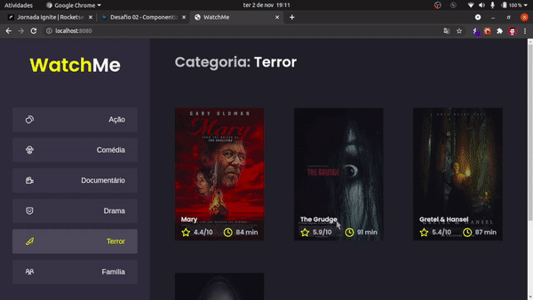

# Movie Gente - Desafio 02 - Trilha React

- Projeto desenvolvido durante o treinamento Ignite da Rocketseat



# Executar

- Requisito: NodeJs

```bash
# Depois de clonar o projeto, navegue até a pasta raiz dele instale as dependências com o comando...
yarn install
# ou
npm i

# Para executar o projeto primeiro inicie a API fake
yarn server

# Agora inicie a aplicação front-end
yarn dev
# ou
npm run dev
```

## Link para o desafio

[Desafio 01 - Trilha React - Ignite](https://www.notion.so/Desafio-02-Componentizando-a-aplica-o-b9f0f025c95b437699d0c3115f55b0f1)
